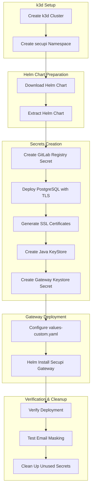

# Secupi Gateway SSL Deployment - Commands How-To Guide

## Overview
This guide explains the sequence of commands used to deploy the Secupi Gateway with SSL verify-full mode on a local k3d Kubernetes cluster, connecting to a PostgreSQL database with email masking functionality.

## Deployment Flow



## Detailed Command Sequence

### 1. Create k3d Cluster
```bash
k3d cluster create secupi-cluster --port "5432:5432@loadbalancer" --wait
```
- Creates a local Kubernetes cluster using k3d
- Maps port 5432 from the load balancer to the host for database access
- `--wait` ensures the cluster is fully ready before proceeding

### 2. Create secupi Namespace
```bash
kubectl create namespace secupi
```
- Creates a dedicated namespace for all Secupi components
- Isolates resources and simplifies management

### 3. Download and Extract Helm Chart
```bash
wget https://storage.googleapis.com/secupi-shared/secupi-gateway-postgresql-7.0.0-59.tgz
mkdir -p secupi-chart
tar -xzvf secupi-gateway-postgresql-7.0.0-59.tgz -C secupi-chart
```
- Downloads the Secupi Gateway Helm chart archive
- Creates a directory for the chart and extracts it

### 4. Create GitLab Registry Secret
```bash
kubectl create secret docker-registry gitlab-registry-secret \
  --namespace secupi \
  --docker-server=registry.gitlab.com \
  --docker-username=gitlab \
  --docker-password=<YOUR_GITLAB_PAT> \
  --docker-email=<YOUR_EMAIL>
```
- Creates authentication secret for pulling Secupi Gateway images from GitLab
- Uses personal access token (PAT) as password
- Username is set to "gitlab" as required by GitLab container registry

### 5. Deploy PostgreSQL with TLS
```bash
# Create TLS configuration file
cat > postgresql-tls-values.yaml <<EOF
tls:
  enabled: true
  autoGenerated: true
  preferServerCiphers: true
EOF

# Deploy PostgreSQL using Bitnami chart
helm install postgresql bitnami/postgresql -n secupi -f postgresql-tls-values.yaml
```
- Enables SSL/TLS on PostgreSQL with auto-generated certificates
- `preferServerCiphers: true` ensures stronger cipher preferences
- PostgreSQL is now ready to accept secure connections
- **Note**: The `postgresql-tls-values.yaml` file is a reusable Helm values file (not a patch) that can be used across multiple PostgreSQL deployments. This modular approach keeps TLS configuration separate from other PostgreSQL settings and allows for consistent TLS setup across different environments.

**Reusable Configuration**: To deploy PostgreSQL with the same TLS settings in a different namespace or environment:
```bash
helm install postgresql-prod bitnami/postgresql -n production -f postgresql-tls-values.yaml
```

### 6. Generate SSL Certificates for Secupi Gateway
```bash
mkdir -p ssl-certs
cd ssl-certs

# Generate private key
openssl genrsa -out gateway.key 2048

# Create certificate signing request
openssl req -new -key gateway.key -out gateway.csr -subj "/CN=secupi-gateway/O=Secupi/C=US"

# Generate self-signed certificate
openssl x509 -req -days 365 -in gateway.csr -signkey gateway.key -out gateway.crt
```
- Creates a directory for SSL certificate files
- Generates a 2048-bit RSA private key for the gateway
- Creates a certificate signing request with organizational details
- Generates a self-signed certificate valid for 365 days

### 7. Create Java KeyStore (JKS)
```bash
# Convert certificate and key to PKCS12 format
openssl pkcs12 -export -in gateway.crt -inkey gateway.key \
  -out gateway.p12 -name secupi-gateway \
  -password pass:test123456

# Convert PKCS12 to Java KeyStore (JKS)
keytool -importkeystore \
  -srckeystore gateway.p12 -srcstoretype PKCS12 -srcstorepass test123456 \
  -destkeystore secupi-gateway.jks -deststoretype JKS -deststorepass test123456 \
  -alias secupi-gateway
```
- Converts the certificate and key to PKCS12 format for Java compatibility
- Creates a Java KeyStore (JKS) from the PKCS12 file
- Uses password "test123456" for both stores
- Sets up the alias "secupi-gateway" for certificate identification

### 8. Create Gateway Keystore Secret
```bash
kubectl create secret generic secupi-gateway-gateway-keystore \
  --namespace secupi \
  --from-file=keystore.jks=secupi-gateway.jks
```
- Creates a Kubernetes secret containing the JKS file
- Makes the keystore available to the Secupi Gateway pods

### 9. Configure values-custom.yaml
The custom values file includes:
- Image repository and tag configuration
- GitLab registry secret reference
- PostgreSQL connection details
- SSL environment variables and keystore configuration
- Service configuration

### 10. Deploy Secupi Gateway
```bash
helm install secupi-gateway ./secupi-chart/secupi-gateway-postgresql -n secupi -f values-custom.yaml
```
- Installs the Secupi Gateway using the Helm chart
- Applies custom configuration from values-custom.yaml
- Deploys to the secupi namespace

### 11. Verify Deployment
```bash
# Check pod status
kubectl get pods -n secupi

# Check service status
kubectl get svc -n secupi
```
- Confirms that all pods are running and ready
- Verifies that services are properly configured

### 12. Test Email Masking
```bash
# Set up port-forwarding for testing
kubectl port-forward service/secupi-gateway-gateway 5433:5432 -n secupi

# Test database connection and email masking
psql -h 127.0.0.1 -p 5433 -U postgres -d postgres -c "SELECT * FROM customers LIMIT 1;"
```
- Creates a port-forward from local port 5433 to gateway service port 5432
- Connects to the database through the gateway and executes a test query
- Verifies that email addresses are properly masked (appear as XXXX0@example.com)

### 13. Clean Up Unused Secrets
```bash
# List all secrets to identify unused ones
kubectl get secrets -n secupi

# Delete unused secret
kubectl delete secret secupi-gateway-tls -n secupi
```
- Identifies and removes the unused `secupi-gateway-tls` secret
- Maintains only the necessary secrets in the namespace

## Verification Results

### Database Connection Test
✅ **SUCCESS** - Secupi Gateway successfully connects to PostgreSQL database through port-forwarding

### Email Masking Verification
✅ **SUCCESS** - Email addresses are properly masked when queried through the gateway
- Original email: `john.doe@example.com`
- Masked email: `XXXX0@example.com`

## Key Environment Variables Used

- `GATEWAY_SERVER_SSL_MODE: "verify-full"` - Enables strict SSL verification
- `GATEWAY_SSL_ENABLED: "true"` - Activates SSL on the gateway
- `KEYSTORE_SSL_STOREPASS: "test123456"` - Keystore password
- `KEYSTORE_SSL_PATH: "/opt/secupi/etc/keystore.jks"` - Keystore file path
- `KEYSTORE_SSL_ALIAS: "1"` - Certificate alias in keystore

## Troubleshooting Notes

1. **Truststore Issue**: Initially attempted to configure truststore as a base64 string in values-custom.yaml, which caused Java SSL errors (`toDerInputStream rejects tag type 77`). Removed this configuration as it was not required for the gateway to function properly.

2. **PostgreSQL TLS Enablement**: PostgreSQL was initially deployed without TLS. Used Bitnami Helm chart's TLS configuration section to enable SSL with auto-generated certificates.

3. **Connection Testing**: Established port-forwarding on local port 5433 to test gateway connectivity and verify email masking functionality.

## Next Steps for Production Deployment

1. Replace self-signed certificates with proper SSL certificates
2. Configure network policies for restricted access
3. Set up proper monitoring and alerting
4. Implement backup and restore procedures
5. Configure Horizontal Pod Autoscaling (HPA)
6. Set up proper load balancing and external access
