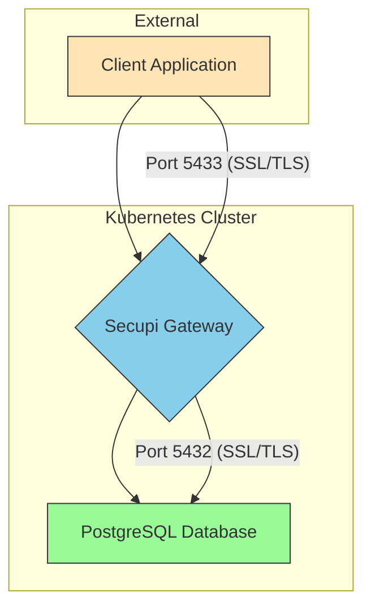

# Secupi Gateway SSL Deployment - Complete Guide

## Overview
This comprehensive guide provides all the necessary steps, commands, and configurations for deploying Secupi Gateway on a local k3d Kubernetes cluster with SSL verify-full mode enabled for secure PostgreSQL database connectivity and email masking functionality.

## Architecture Flow

The following diagram shows how the Secupi Gateway works in the deployed architecture:



The Secupi Gateway acts as a proxy that intercepts database connections, applies data masking policies (such as email obfuscation), and forwards the requests to the PostgreSQL database while maintaining end-to-end SSL encryption.

## Prerequisites
- k3d installed locally
- kubectl installed and configured
- Helm 3 installed
- OpenSSL and keytool for certificate generation

## Deployment Steps

### 1. Create k3d Cluster and Namespace
```bash
k3d cluster create secupi-cluster --port "5432:5432@loadbalancer" --wait
kubectl create namespace secupi
```

### 2. Download and Extract Helm Chart
```bash
wget https://storage.googleapis.com/secupi-shared/secupi-gateway-postgresql-7.0.0-59.tgz
mkdir -p secupi-chart
tar -xzvf secupi-gateway-postgresql-7.0.0-59.tgz -C secupi-chart
```

### 3. Create GitLab Registry Secret
```bash
kubectl create secret docker-registry gitlab-registry-secret \
  --namespace secupi \
  --docker-server=registry.gitlab.com \
  --docker-username=gitlab \
  --docker-password=<YOUR_GITLAB_PAT> \
  --docker-email=<YOUR_EMAIL>
```

### 4. Deploy PostgreSQL with TLS

First, create the PostgreSQL TLS configuration file:
```bash
cat > postgresql-tls-values.yaml <<EOF
tls:
  enabled: true
  autoGenerated: true
  preferServerCiphers: true
EOF
```

Then deploy PostgreSQL:
```bash
helm install postgresql bitnami/postgresql -n secupi -f postgresql-tls-values.yaml
```

### 5. Create SSL Certificates and Keystore

Generate a self-signed certificate:
```bash
openssl req -x509 -nodes -days 365 -newkey rsa:2048 \
  -keyout secupi-gateway-key.pem \
  -out secupi-gateway-cert.pem \
  -subj "/CN=secupi-gateway-gateway.secupi.svc.cluster.local/O=Secupi"
```

Convert to PKCS12 format:
```bash
openssl pkcs12 -export -inkey secupi-gateway-key.pem \
  -in secupi-gateway-cert.pem \
  -out secupi-gateway.p12 \
  -name secupi-gateway -passout pass:test123456
```

Convert to Java KeyStore format:
```bash
keytool -importkeystore -srckeystore secupi-gateway.p12 \
  -srcstoretype PKCS12 \
  -srcstorepass test123456 \
  -destkeystore secupi-gateway.jks \
  -deststoretype JKS \
  -deststorepass test123456 \
  -alias secupi-gateway
```

### 6. Configure values-custom.yaml

Create or update `secupi-chart/secupi-gateway-postgresql/values-custom.yaml` with the following content:

```yaml
gateway:
  env:
    GATEWAY_SERVER_HOST: "postgresql.secupi.svc.cluster.local"
    GATEWAY_SERVER_PORT: "5432"
    GATEWAY_SERVER_DATABASE: "postgres"
    GATEWAY_SERVER_USERNAME: "postgres"
    GATEWAY_SERVER_PASSWORD: "sWln7EcSAi"  # PostgreSQL password from secret
    GATEWAY_SERVER_SSL_MODE: "verify-full"
    SECUPI_BOOT_URL: "https://damkil.azure.secupi.com/api/boot/download/1e81d3dee43740fbbcbd669a2c3ca3a7/secupi-boot-ea9abf50-9ebf-4e28-9a54-f56d75dec2e5.jar"
    GATEWAY_SSL_ENABLED: "true"
    KEYSTORE_SSL_STOREPASS: "test123456"
    KEYSTORE_SSL_PATH: "/opt/secupi/etc/keystore.jks"
    KEYSTORE_SSL_ALIAS: "secupi-gateway"
    GATEWAY_TRUST_ALL_BACKENDS: "true"

image:
  repository: registry.gitlab.com/secupi/secupi-distribution
  tag: 7.0.0.59
  pullPolicy: IfNotPresent
  imagePullSecrets:
    - name: gitlab-registry-secret

service:
  type: ClusterIP
  port: 5432

ssl:
  enabled: true
  secretName: secupi-gateway-tls
```

### 7. Deploy Secupi Gateway

Install the Secupi Gateway using Helm:
```bash
helm install secupi-gateway ./secupi-chart/secupi-gateway-postgresql -n secupi -f ./secupi-chart/secupi-gateway-postgresql/values-custom.yaml
```

### 8. Create Database Table and Test Data

First, get the PostgreSQL password:
```bash
kubectl get secret postgresql -n secupi -o jsonpath='{.data.postgres-password}' | base64 -d
```

Set up port-forward to PostgreSQL:
```bash
kubectl port-forward service/postgresql 5434:5432 -n secupi &
```

Create the customers table and insert test data:
```bash
psql -h 127.0.0.1 -p 5434 -U postgres -d postgres -c "
CREATE TABLE customers (
  id SERIAL PRIMARY KEY,
  name VARCHAR(100),
  email VARCHAR(100)
);"

psql -h 127.0.0.1 -p 5434 -U postgres -d postgres -c "
INSERT INTO customers (name, email) VALUES 
('John Doe', 'john.doe@example.com'),
('Jane Smith', 'jane.smith@example.com'),
('Bob Johnson', 'bob.johnson@example.com');"
```

Verify the data:
```bash
psql -h 127.0.0.1 -p 5434 -U postgres -d postgres -c "SELECT * FROM customers;"
```

### 9. Test Secupi Gateway Connection

Set up port-forward to Secupi Gateway:
```bash
kubectl port-forward service/secupi-gateway-gateway 5433:5432 -n secupi &
```

Test the connection through the gateway:
```bash
psql -h 127.0.0.1 -p 5433 -U postgres -d postgres -c "SELECT * FROM customers;"
```

## Troubleshooting

### Common Issues and Solutions

1. **Helm Installation Fails with Secret Ownership Error**:
   - Delete the existing secret: `kubectl delete secret secupi-gateway-gateway-keystore -n secupi`
   - Let Helm recreate it during installation

2. **Keystore Path Issues**:
   - Ensure `KEYSTORE_SSL_PATH` is set to `/opt/secupi/etc/keystore.jks` in values-custom.yaml
   - This is the correct in-container path where the keystore is mounted

3. **SCRAM Authentication Failures**:
   - If you encounter `FATAL: SCRAM channel binding check failed`, try:
     - Using a different authentication method in PostgreSQL
     - Disabling channel binding in PostgreSQL configuration
     - Ensuring SSL settings match between client and server

4. **Port-Forward Connection Issues**:
   - Check that pods are running: `kubectl get pods -n secupi`
   - Restart port-forward if it exits: `kubectl port-forward service/secupi-gateway-gateway 5433:5432 -n secupi &`

5. **k3d Cluster Access Issues After Stopping**:
   - k3d clusters are ephemeral by default; stopping or deleting a cluster removes all workloads and state
   - To prevent loss of access or data:
     - Always recreate the cluster using the same creation commands from the guide
     - For persistent data, use external PostgreSQL or configure persistent volumes
     - Document your cluster recreation steps and keep configuration files safe
   - To recreate the cluster after stopping:
     ```bash
     k3d cluster create secupi-cluster --port "5432:5432@loadbalancer" --wait
     kubectl create namespace secupi
     # Then redeploy all components using the steps in this guide
     ```

## Cleanup

To remove unused secrets:
```bash
kubectl get secrets -n secupi
# Identify and delete any unused secrets
kubectl delete secret <secret-name> -n secupi
```

## Next Steps for Production Deployment

1. **Use Production Certificates**: Replace self-signed certificates with proper SSL certificates from a trusted CA.
2. **PostgreSQL TLS Enablement**: For production, use proper certificates instead of auto-generated ones.
3. **Connection Testing**: Establish proper monitoring and alerting for gateway connectivity.

This guide provides a complete, consolidated approach to deploying and testing Secupi Gateway with SSL on a local k3d Kubernetes cluster.
